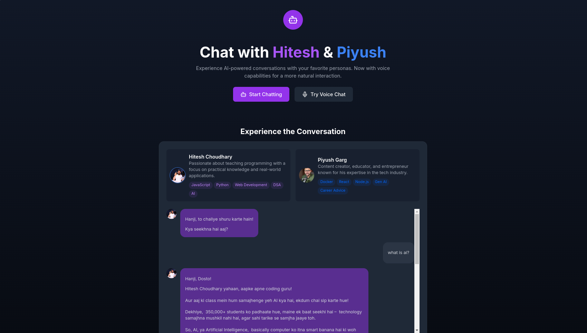
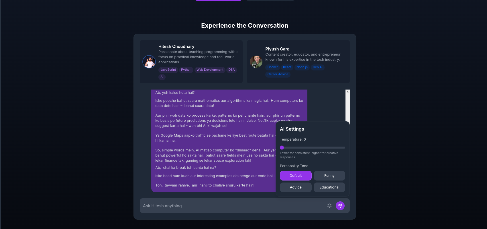
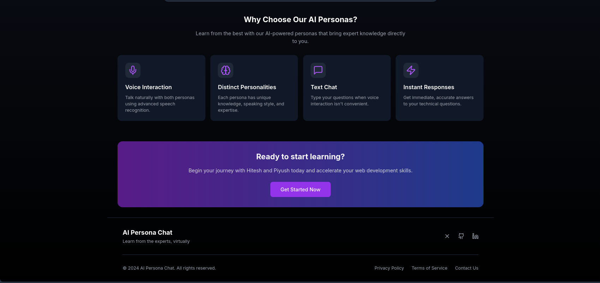

# HPersona 🤖

A Next.js application that lets you chat with AI-powered personas of popular tech educators. Experience interactive learning through conversations with Hitesh Choudhary and Piyush Garg.

## Live Demo
[Try HPersona](your-vercel-deployment-url)

## Screenshots :
- 
- 
- 
## ✨ Features

- 🎭 Multiple AI Personas
  - Chat with Hitesh Choudhary (LearnCodeOnline, PW)
  - Chat with Piyush Garg (Teachyst)
- 🗣️ Hinglish Conversations
- 🎚️ Adjustable AI Parameters
  - Temperature control
  - Different conversation tones
- 💅 Responsive Design
- ⚡ Real-time Chat Interface

## 🚀 Setup

```bash
# Install dependencies
npm install

# Run development server
npm run dev

# Build for production
npm run build
```

## 🛠️ Tech Stack

- Next.js 14.1.0
- React 18.3.1
- TypeScript
- Tailwind CSS
- Google Gemini AI
- Framer Motion

## 🔑 Environment Variables

Create a `.env` file in the root directory:

```env
GEMINI_API_KEY=your_gemini_api_key_here
```

## 📦 Project Structure

```
app/
├── api/
│   └── chat/         # AI chat endpoints
├── components/       # React components
├── layout.tsx       # Root layout
└── page.tsx         # Main page
```

## 🤝 Contributing

1. Fork the repository
2. Create your feature branch (`git checkout -b feature/AmazingFeature`)
3. Commit your changes (`git commit -m '✨ Add some AmazingFeature'`)
4. Push to the branch (`git push origin feature/AmazingFeature`)
5. Open a Pull Request

## 📝 License

This project is open source and available under the MIT License.

## 👤 Contact

Created by [Your Name]
- LinkedIn: [\[AnantGabhane\]](https://www.linkedin.com/in/anantgabhane/)
- Twitter: [\[AnantGabhane\]](https://x.com/AnantGabhane)

## 🙏 Acknowledgments

- Hitesh Choudhary
- Piyush Garg
- Google Gemini AI
